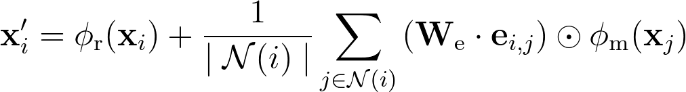

# MatrixConv

`MatrixConv` is a graph convolutional filter for graphs where the node features are n-dimensional matrices, such as 2D or 3D images, such as a [scene graph](https://en.wikipedia.org/wiki/Scene_graph). The filter applies a (non-graph) convolution, i.e. `torch.nn.Conv{1/2/3}d`, to transform the node features. Node embeddings are updated like so:

<p align="center">
    
</p>

Where _&phi;<sub>r</sub>_ and _&phi;<sub>m</sub>_ are CNNs ([`torch.nn.Conv{1/2/3}d`](https://pytorch.org/docs/stable/nn.html#torch.nn.Conv1d)), and _W<sub>e</sub>_ is a weight matrix.

## Installation

This module can be installed with `pip`:

```bash
$ pip install matrix_conv
```

## Usage

`MatrixConv` is built on PyTorch Geometric and derives from the [`MessagePassing`](https://pytorch-geometric.readthedocs.io/en/latest/modules/nn.html#torch_geometric.nn.conv.message_passing.MessagePassing) module. It expects an input graph where each node's "features" is a matrix (either 1D, 2D, or 3D). `MatrixConv`, similarly to [`NNConv`](https://pytorch-geometric.readthedocs.io/en/latest/modules/nn.html#torch_geometric.nn.conv.NNConv), also incorporates any available edge features when collecting messages from a node's neighbors.

**Parameters:**

- **in_channels** (_int_): Number of channels in the input node matrix (e.g. if each node's features is a 3x5 matrix with 2 input channels, then `in_channels=2`)
- **out_channels** (_int_): Number of channels in the output node embedding
- **matrix_dims** (_list_ or _tuple_): Dimensions of matrix associated with node (e.g. if each node's features is a 3x5 matrix, then `matrix_dims=[3, 5]`)
- **num_edge_attr** (_int_): Number of edge attributes/features
- **kernel_dims** (_list_ or _tuple_): Dimensions of the convolving kernel in the CNN
- **aggr** (_string_, _optional_): The message aggregation scheme to use ("add", "mean", "max")
- **root_cnn** (_bool_, _optional_): If set to `False`, the layer will not add the CNN-transformed root node features to the output
- **bias** (_bool_, _optional_): If set to `False`, the layer will not learn an additive bias
- **\*\*kwargs** (_optional_): Additional arguments for `torch.nn.Conv{1/2/3}d`

**Example Usage:**

```python
import torch
from matrix_conv import MatrixConv

# Convolutional layer
conv_layer = MatrixConv(
    in_channels=1,
    out_channels=10,
    matrix_dims=[5, 5, 5],
    num_edge_attr=3,
    kernel_dims=[2, 3, 3]
)

# Your input graph (see: https://pytorch-geometric.readthedocs.io/en/latest/notes/introduction.html#data-handling-of-graphs)
x = torch.randn((3, 1, 5, 5, 5), dtype=torch.float) # Shape is [num_nodes, in_channels, *matrix_dims]
edge_index = torch.tensor([
    [0, 1, 1, 2],
    [1, 0, 2, 1]
], dtype=torch.long)
edge_attr = torch.randn((4, 3), dtype=torch.float)

# Your output graph
x = conv_layer(x, edge_index, edge_attr) # Shape is now [3, 10, 4, 3, 3]
```

**To-Do:** Show example of using this in a graph classifier (include stacking)
